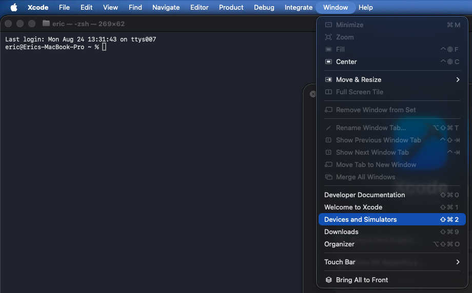

# UNSWager

## Setup
Run
```
npm install
```
then create a .env file and put the environmental variables in there.

## Git Quick Guide
Creating a new branch
```
git checkout -b "<branch-name>"
```

Moving between branches
```
git checkout "<target-branch>"
```

Pulling commits and changes from main branch. ALWAYS DO THIS AT THE START OF YOUR SESSION!
```
git pull origin main
```

The Commit Cycle (You'll always do this for changes you make):
```
git add [.|<file1> <file2 ...] # . or * means to add ALL the files you made changes to since your last commit
git commit -m "<message>"      # make sure the message is descriptive so you have an idea of what happens
git push
```

Merging
When you do git push, there will be a merge link you can click on to create a PR (Pull Request). Always add Avi and Eric as reviewers.
**NEVER** approve your own PRs and **always** merge your own PR once *approved*.

## Supabase
Setting up
```
supabase login
supabase link       # Then select cyberpunk2077 as the project to link to
supabase db pull    # Pull changes made by other people
```

### App connection

Create `.env` from `.env.example` and add the Supabase project URL and publishable/anon key:

```env
EXPO_PUBLIC_SUPABASE_URL=https://your-project.supabase.co
EXPO_PUBLIC_SUPABASE_ANON_KEY=your-supabase-anon-key
```

The app only uses these public client variables. Never put a `service_role`, secret key, database password, or other private credential in `.env` or client code. Apply the migrations and deploy the authenticated betting function before testing the app:

```bash
supabase db push
supabase functions deploy place_bet
```

To enable the existing admin screens for a user, assign the role from a trusted Supabase SQL editor or server-side process:

```sql
update public.profiles
set role = 'ADMIN'
where email = 'admin@unsw.edu.au';
```

Running locally
```
supabase start
supabase status            # Optional: You can use it to access local dashboard.
supabase status -o json    # Optional: This is done to get your supabase keys for the supabase client to work.
supabase stop --no-backup  # Stopping the db. The --no-backup flag clears cache data. Lowk underrated.
```

## Simulation (MacOS only)
You will need an iPhone, a Mac and a cable
### Xcode Installation
If you don't have xcode installed on your mac, install it from the app store.

Then, open your terminal and run
```
xcode-select --install
```
and then log in to xcode using your Apple account.

### iPhone Setup
Connect your iPhone to your Mac via cable.
On your phone, enable Developer mode. Do this by opening
```
Settings > Privacy & Security > Developer Mode
```
and make sure it's toggled on. You might need to restart your phone.

### iPhone - Mac Connection Setup
In Xcode, in your Mac's menu bar (top-left of the screen) open Window > Devices and Simulators


Select the '+' in the bottom left and select your phone. It will take some time to set up signing.

Now it's time for simulating!

### Running Simulations on Mac
In your code editor, from the project root, run
```
npx expo prebuild -p ios --clean; # This will create the folder /ios with all the build data and stuff to run native
npx expo run:ios --device <phone name>
```

If you don't know your phone name, you can also run
```
npx expo run:ios --device
```
then select a phone to simulate on. There should only be one phone (your phone) so select it and have fun.
